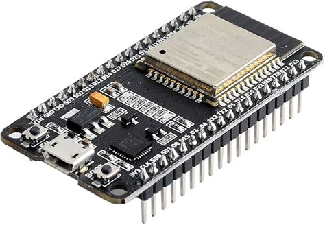
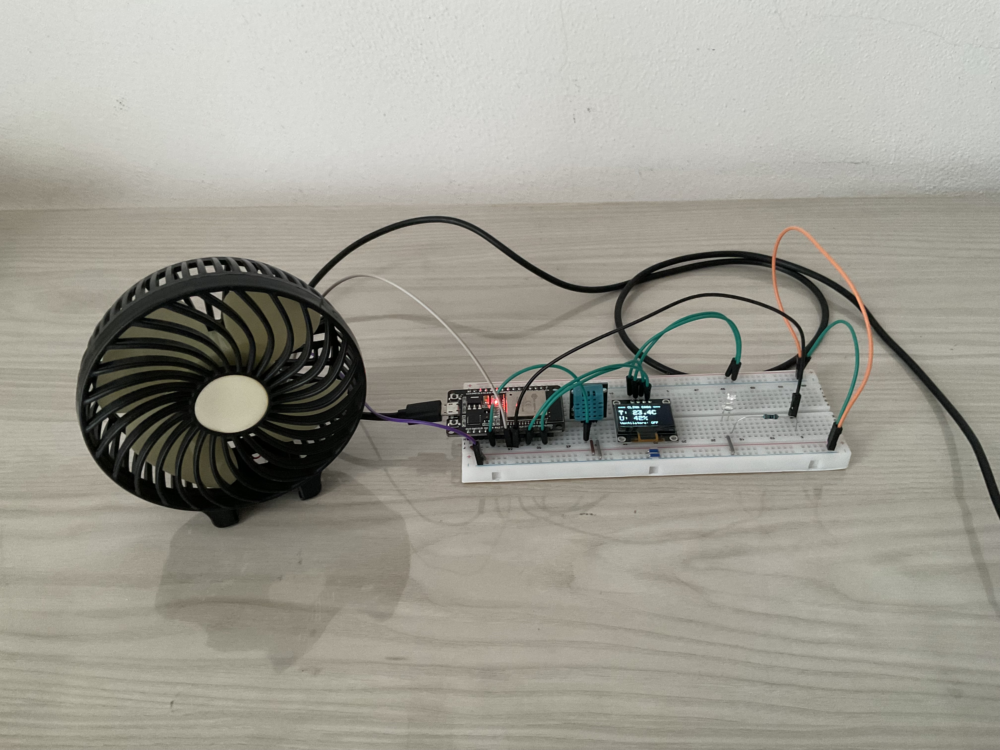
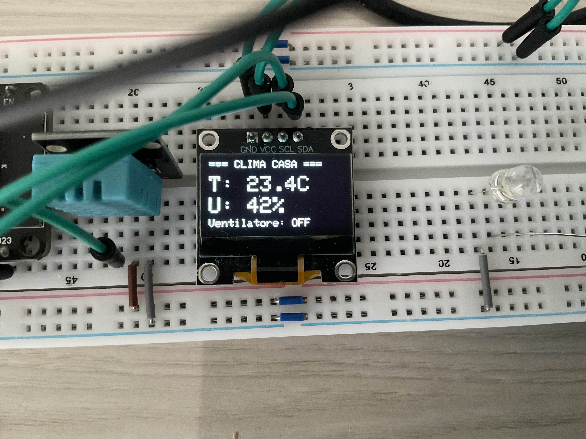
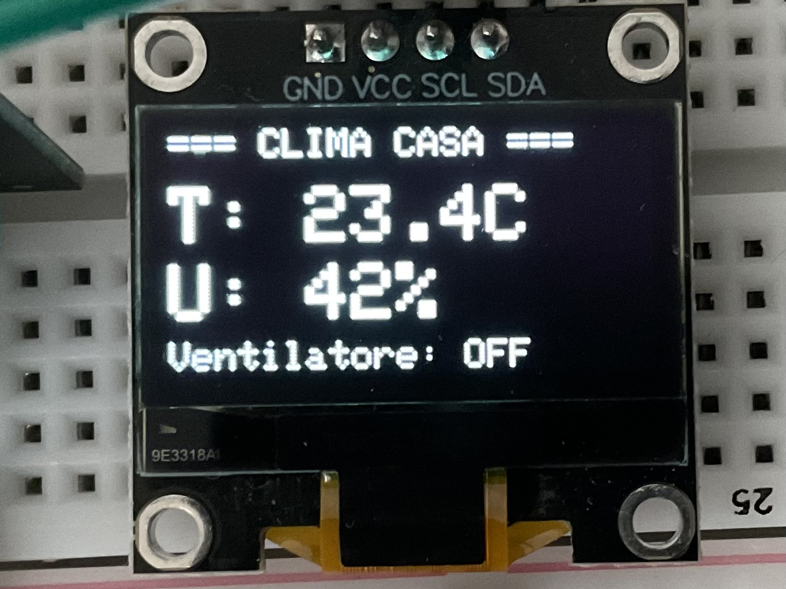
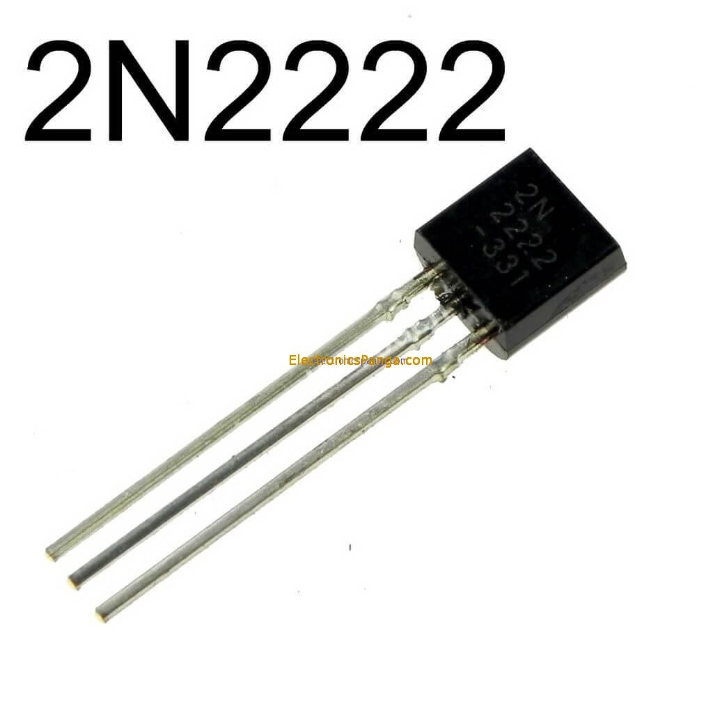

# Sistema Controllo Ventilatore ESP32

Questo progetto è un sistema automatico per il controllo di un ventilatore basato sulla temperatura ambiente. Quando la temperatura supera la soglia impostata, il ventilatore si accende automaticamente.





## Hardware Necessario
- ESP32
- Sensore di temperatura e umidità DHT11
- Display OLED 128x64 (I2C)
- Ventilatore 5V
- LED bianco
- Resistenza 220Ω
- Transistor 2N2222 + Resistenza 1k

## Collegamenti
| Componente             | Pin ESP32 / Collegamento                 |
|------------------------|-----------------------------------------|
| DHT11 Data             | D4                                      |
| OLED SDA               | D21                                     |
| OLED SCL               | D22                                     |
| LED bianco             | D18                                     |
| Ventilatore positivo   | Alimentazione 3.3V o 5V (non su pin ESP32) |
| Transistor 2N2222 Base | D15 tramite resistenza 1 kΩ              |
| Transistor 2N2222 Collettore | Ventilatore polo negativo           |
| Transistor 2N2222 Emettitore | GND comune (ESP32 + alimentazione)  |
       


## Librerie Richieste
Installa queste librerie tramite l'IDE Arduino:
- DHT sensor library (Adafruit)
- Adafruit GFX Library
- Adafruit SSD1306

## Funzionamento
Il sistema legge continuamente temperatura e umidità dal sensore DHT11. Quando la temperatura supera i 24°C, il ventilatore si accende automaticamente e il LED si spegne per indicare che il sistema è attivo.

Il display OLED mostra in tempo reale:
- Temperatura con un decimale
- Umidità in percentuale
- Stato del ventilatore (ON/OFF)

## Configurazione
Per modificare la soglia di temperatura, cambia questa riga nel codice:
```cpp
const float TEMP_SOGLIA = 24.0;  // Temperatura in gradi Celsius
```

## Problemi Iniziali con il Pin GPIO e Soluzioni Provate

All’inizio ho avuto problemi a regolare il ventilatore dal pin GPIO D2:

    Il pin GPIO non riusciva a fornire abbastanza corrente per il ventilatore.

    Collegare il ventilatore direttamente al pin GPIO rischiava di danneggiare l’ESP32.

    Ho provato a usare MOSFET non logic-level, ma il ventilatore rimaneva sempre acceso o non si spegneva.

    Collegamenti errati del MOSFET causavano malfunzionamenti.

    Mancanza di resistenza pull-down sul gate del MOSFET faceva rimanere acceso il ventilatore anche a pin LOW.

## Soluzioni Provate e Risultati

    Usare transistor MOSFET logic-level: non disponibile o non funzionante bene.

    Aggiungere resistenza pull-down tra gate e massa: migliorava ma non risolveva del tutto.

    Usare modulo relè: soluzione sicura ma non voluta.

### Soluzione definitiva: usare transistor NPN 2N2222 con collegamenti corretti.
[CLICCA PER VIDEO DIMOSTRATIVO](https://drive.google.com/drive/folders/1GUEUTkNlYGJk-smshIuskiLKClhBi8_J?usp=drive_link)

### Nota : La qualità originale è stata diminuita dalla compressione di Google Drive, mi dispiace per il disagio ;) 

<br>

<div style="text-align: center;">
    
    
    
    
    
    
    
</div>

<div style="text-align: center;">
    <a href="immagini/Presentazione.pdf" target="_blank" style="display: inline-block; margin-top: 20px;">
        <button style="padding: 10px 20px; border-radius: 5px; background-color: #4CAF50; color: white; border: none;">
            Visualizza Presentazione
        </button>
    </a>
</div>


