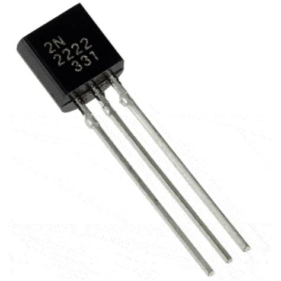

# Sistema di Controllo Ventilatore con ESP32 <br>

Un progetto per automatizzare l'accensione di un ventilatore in base alla temperatura ambientale, usando un **ESP32**, un **sensore DHT11** e un **transistor NPN 2N2222**. <br>

<p align="center">  
    
</p> <br>

---

## 🛠️ Hardware Necessario <br>

- ESP32  
- Sensore temperatura e umidità DHT11  
- Display OLED 128x64 (I2C)  
- Ventilatore >5V  
- LED bianco  
- Resistenza 220Ω  
- Transistor NPN 2N2222 con resistenza da 1kΩ <br>

---

## 📌 Schema di Collegamento <br>

| Componente                  | Collegamento ESP32 / Note                          |  
|----------------------------|----------------------------------------------------|  
| DHT11 (Data)               | D4                                                 |  
| OLED (SDA)                 | D21                                                |  
| OLED (SCL)                 | D22                                                |  
| LED bianco                 | D18                                                |  
| Ventilatore (positivo)     | Alimentazione esterna 3.3V o 5V                   |  
| 2N2222 (Base)              | D15 tramite resistenza 1kΩ                         |  
| 2N2222 (Collettore)        | Ventilatore (polo negativo)                       |  
| 2N2222 (Emettitore)        | GND comune (ESP32 + alimentazione)                | <br>

---

## 🏗️ Librerie Arduino Richieste <br>

Installa le seguenti librerie tramite il Library Manager dell’IDE Arduino:  

- DHT sensor library (Adafruit)  
- Adafruit GFX Library  
- Adafruit SSD1306 <br>

---

## 🎯 Funzionamento del Sistema <br>

Il sistema rileva costantemente temperatura e umidità. Quando la temperatura supera i **24°C**, il ventilatore si attiva automaticamente e il LED bianco si spegne.  

Sul display OLED vengono mostrati in tempo reale:  
- 🌡️ **Temperatura** (con decimale)  
- 💧 **Umidità relativa** (%)  
- 🔄 **Stato del ventilatore**: ON / OFF <br>

---

## ⚙️ Configurazione <br>

Puoi modificare la soglia di attivazione della temperatura agendo sulla costante nel codice. <br>
```cpp
const float TEMP_SOGLIA = 24.0;  // Temperatura in gradi Celsius
```

---

## ⚡ Come funziona il Transistor NPN (2N2222) <br>

Un **transistor NPN** come il **2N2222** è usato come interruttore elettronico.  

Quando una **piccola corrente entra nella base**, il transistor consente il **passaggio di corrente tra collettore ed emettitore**. Questo permette di **controllare dispositivi** come un ventilatore utilizzando un segnale di **bassa potenza** proveniente da un GPIO dell’ESP32.  

**Processo di attivazione**:  
- La **base** riceve corrente da un GPIO tramite una resistenza da **1kΩ**.  
- Quando il transistor si **attiva**, il **collettore** (collegato al negativo del ventilatore) consente il flusso di corrente verso l’**emettitore** (collegato a GND).  
- 💨 Il **ventilatore** riceve quindi corrente completa dal suo **positivo verso massa**, e si **attiva**.  

<p align="center">  
    
</p> <br>

---

## ⚠️ Problematiche Iniziali <br>

Durante lo sviluppo si sono riscontrati i seguenti problemi:  

- **Corrente insufficiente** dal pin GPIO per alimentare il ventilatore  
- **Possibile danno** all’ESP32 in caso di collegamento diretto  
- **Malfunzionamenti** con MOSFET non logic-level  
- **Comportamenti erratici** per assenza di resistenza pull-down  

**🚫 Soluzioni non disponibili:**  
- Utilizzo di **MOSFET logic-level**  
- Utilizzo di **modulo relè**  

**Soluzione adottata:**  

💡 Utilizzo di un **transistor NPN 2N2222** con **resistenza di base da 1kΩ**, che ha garantito:  

- **Corrente adeguata** per il carico  
- **Protezione dell’ESP32**  
- **Stabilità e sicurezza operativa** <br>

---

## 🎥 Video Dimostrativo <br>

🔗 Guarda il **video su Google Drive**.  
📌 Nota: la qualità è stata ridotta dalla compressione di Google Drive. <br>

---

## 🖼️ Galleria Immagini <br>

<p align="center">  
    
    
    
    
    
</p> <br>

IMG_8422.jpeg
---

## 📑 Presentazione del Progetto <br>

<p align="center">  
  <a href="immagini/Presentazione.pdf" target="_blank">  
      
  </a>  
</p> 


## 💻 Codice del Progetto <br>

<p align="center">  
  <a href="main.ino" target="_blank">  
      
  </a>  
</p> 

<br>

<iframe src="https://gamma.app/embed/mlvxr0j55hpe9pn" style="width: 700px; max-width: 100%; height: 450px" allow="fullscreen" title="Sistema di Controllo Ventilatore con ESP32"></iframe>
